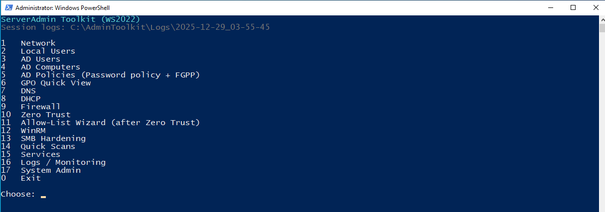
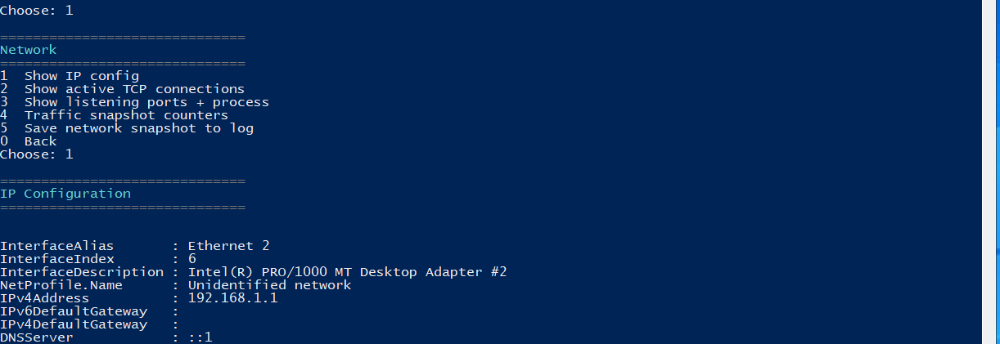
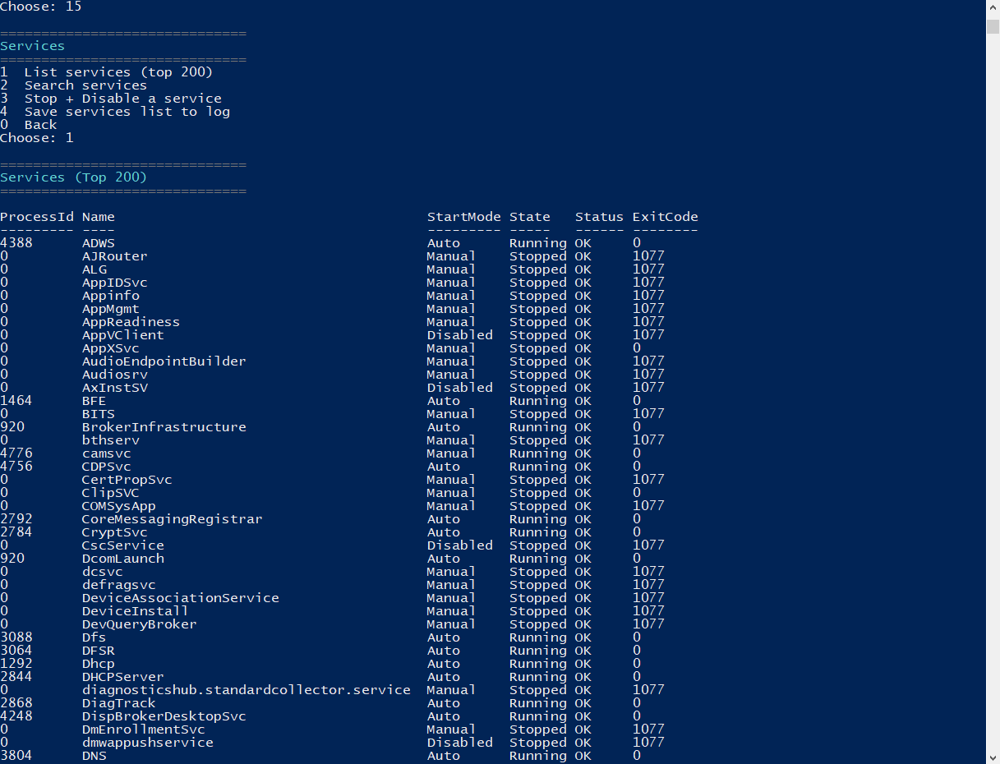
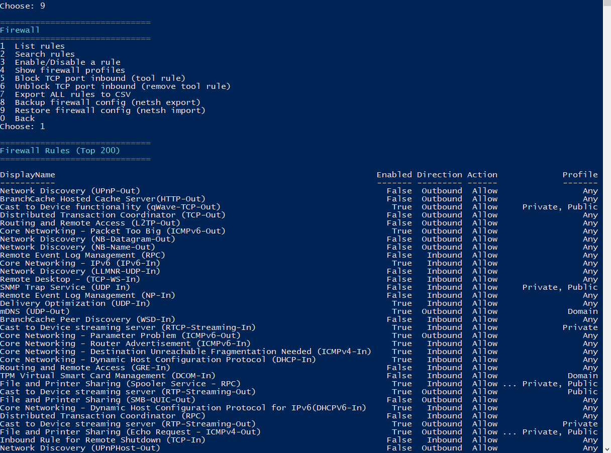
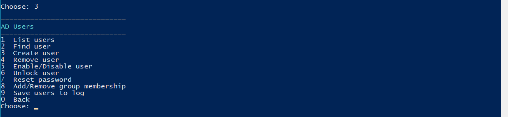
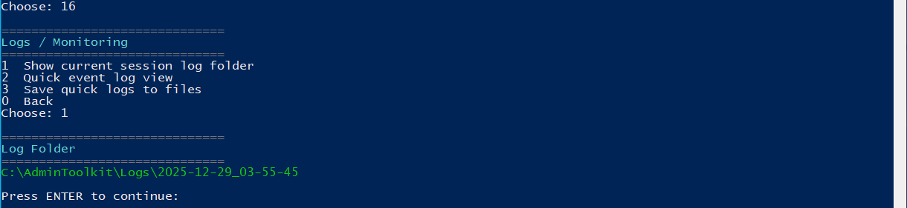

# ServerAdmin Toolkit (Windows Server 2022)

A menu-driven PowerShell toolkit designed to help system administrators perform common Windows Server tasks quickly, safely, and consistently from a single interface.

This tool was built for learning, lab environments, and portfolio demonstration, following real-world sysadmin workflows.

---

## Features

The toolkit provides fast access to common administrative tasks without manually searching through Windows menus or consoles.

### User and Computer Management
- List local users
- Add and remove local users
- Local password policy checks
- Active Directory user management (if AD module is available)
- Active Directory computer management
- Disable or move computer accounts to OUs

### Network and Security
- View network configuration and active connections
- Scan for open TCP ports
- Zero Trust mode (block all inbound firewall rules with confirmation)
- Allow-list wizard for essential services after Zero Trust
- Firewall rule enable, disable, backup, and restore
- SMB hardening checks (SMBv1, signing, NTLM settings)
- WinRM enable, disable, and TrustedHosts management

### Services and System
- List Windows services using reliable CIM queries
- Search services by name or display name
- Stop and disable unwanted or risky services
- Clear status reporting with verification

### Group Policy
- List all Group Policy Objects
- Search GPOs by name
- View direct and inherited GPO links for an OU or domain
- Save GPO information to logs

### DNS and DHCP
- DNS zone and record checks (if DNS role is installed)
- DHCP scope and lease inspection (if DHCP role is installed)
- Input validation to prevent incorrect commands

### Logging and Reporting
- All actions and outputs are logged
- Logs are saved per session with timestamps
- Easy to export data for reports or audits

---

## How to Run

Follow these steps to run the toolkit safely and correctly.

### Step 1  Open PowerShell as Administrator
- Click Start
- Search for PowerShell
- Right-click and select Run as Administrator

Administrator privileges are required because the toolkit manages users, services, firewall rules, and system settings.

---

### Step 2  Navigate to the project folder
Use PowerShell to move into the folder where the script is located.

Example:
in powershell
cd D:\Path\To\serveradmin-toolkit

---

## Screenshots

Below are example screenshots showing the toolkit in use on Windows Server 2022.
These images demonstrate the menu-driven interface and some typical outputs produced by the tool.

Screenshots are taken from a lab environment.

---

### Main Menu (Toolkit Start)

The main menu provides quick access to all administrative areas such as users, networking, security, services, Active Directory, DNS, DHCP, and logging.

---

### System and Network Overview

This view shows basic system and network information, including IP configuration and active connections.
It provides a fast way to understand the current server state without opening multiple tools.

---

### Services Management

The services menu allows administrators to list services, search by name, and safely stop or disable unwanted services.
Status and start mode are clearly displayed.

---

### Firewall and Zero Trust Mode

This screenshot shows firewall management options, including enabling and disabling rules and applying a Zero Trust baseline.
All destructive actions require confirmation.

---

### Active Directory Management

Active Directory features include user and computer management, OU operations, and account status changes.
This menu is only available when the required modules are installed.

---

### Logging and Reports

Each run of the toolkit generates timestamped logs.
These logs can be used for auditing, troubleshooting, or documentation.

